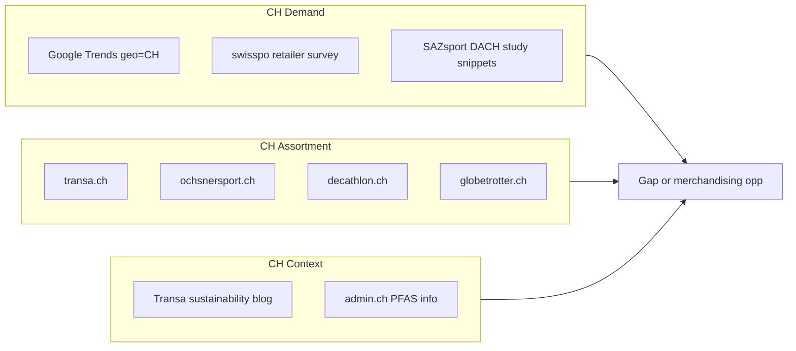

# Data Discovery Guide — Zenline Retail Radar

**Purpose:** Real evidence to collect *before* building the pipeline. Every row in your final `signals.csv` should trace back to a source like those listed here.

**Rule:** Organizers do **not** provide a dataset. You gather public signals yourself. No secrets, no private datasets in git.

---

## Data Strategy (3 layers)

| Layer | What | How today | Used for |
|---|---|---|---|
| **1. Global emergence** | Trend is rising abroad | Publications, trade press, brand launches | "Why now" + first market |
| **2. Momentum** | Search / social interest | Google Trends (pytrends), Tavily news search | `signal_type=search` |
| **3. CH gap** | Local assortment status | `site:transa.ch`, `site:ochsnersport.ch`, `site:decathlon.ch` | `coverage_status` + transferability |

**Winning combo:** same opportunity appears in layers 1 + 2, with an honest layer 3 story (gap or merchandising opportunity).

---

## Switzerland-First: How to Get the Data

**Reframe:** For this hackathon, Switzerland is not just the *transfer target* — it is your **primary data market**. Global signals explain *why now*; Swiss signals explain *what to do here*.

### The CH data model (what to collect)



Every strong recommendation should have **at least one Swiss URL** (retailer, Swiss trade press, or CH Google Trends row).

---

### Step-by-step (do this in order)

#### Step 1 — Swiss search demand (15 min, free)

Use **Google Trends** manually or via **pytrends** with `geo='CH'`.

**Swiss keywords (German — use these, not just English):**

| English seed | Swiss search terms to try |
|---|---|
| PFAS-free waterproof | `PFAS frei jacke`, `PFAS frei outdoor` |
| Ultralight hiking | `ultraleicht wandern`, `fast hiking`, `leichtes wandern` |
| Gravel / trail shoes | `gravel laufschuhe`, `trail running schuhe`, `GRVL schuhe` |
| Packable insulation | `packable isolierung`, `kunstfaser jacke leicht` |
| Running + hiking | `wandern running schuhe` |

**Compare:** run same keywords with `geo='CH'`, `geo='DE'`, `geo='US'` — rising in US but low in CH = early transfer story.

**Manual:** https://trends.google.com → set region to **Switzerland** → compare keywords → screenshot or export.

**Python (when pipeline is built):**
```python
from pytrends.request import TrendReq
pytrends = TrendReq(hl="de-CH", tz=60)  # German Switzerland, CET
pytrends.build_payload(
    kw_list=["PFAS frei jacke", "gravel laufschuhe"],
    geo="CH",
    timeframe="today 12-m",
)
df = pytrends.interest_over_time()
```

Save to `data/cache/trends/` — tag rows `market=CH`, `signal_type=search`.

---

#### Step 2 — Swiss retailer assortment (30 min, free)

Search each retailer for each seed. Record **product URL, price CHF, PFAS/weight if listed**.

| Retailer | Base URL | What to check |
|---|---|---|
| **Transa** | https://www.transa.ch | Premium outdoor; strong sustainability content |
| **Ochsner Sport** | https://www.ochsnersport.ch | Mass + performance; running/hiking volume |
| **Decathlon CH** | https://www.decathlon.ch | Price entry; trend categories |
| **Globetrotter** | https://www.globetrotter.ch | Full-range outdoor |
| **Galaxus** | https://www.galaxus.ch | Marketplace breadth, CH prices |

**Google search templates (copy-paste):**
```
site:transa.ch PFAS frei jacke
site:transa.ch gravel laufschuhe
site:transa.ch ultraleicht zelt
site:ochsnersport.ch trail running schuhe
site:decathlon.ch PFAS frei
site:globetrotter.ch and wander
```

**Tag `coverage_status`:**
- **covered** — many SKUs, clear category
- **partially_covered** — products exist but no dedicated trend lane
- **absent** — no relevant results
- **unknown** — search inconclusive

**Already verified Swiss URLs (use today):**

| Signal | URL | coverage_status |
|---|---|---|
| Transa PFAS FAQ (CH retailer POV) | https://www.transa.ch/de/blog/nachhaltigkeit/pfas-faq/ | covered (narrative) |
| Transa PFAS-free shell 208g | https://www.transa.ch/en/p/arcteryx-alpha-sl-jacket-m-339402-010/ | partially_covered |
| Transa gravel vest (not shoe bay) | https://www.transa.ch/de/p/salomon-gravel-skin-4-set-357211-002/ | partially_covered |
| Transa ultralight tent PFAS-free | https://www.transa.ch/de/p/vaude-ultralight-space-2p-341619-001/ | partially_covered |

---

#### Step 3 — Swiss trade & market context (15 min, free)

These explain **what Swiss retailers actually care about this summer**:

| Source | URL | CH insight |
|---|---|---|
| **swisspo** — Swiss sports retail survey | https://swisspo.ch/de/erfolgreicher-winter-und-chancen-im-sommer-sportartikel-branche-beweist-stabilitaet-und-anpassungsfaehigkeit/ | Hiking + running shoe focus; Swiss staycation → local outdoor |
| **SAZsport DACH outdoor study** | https://www.sazsport.de/news/free/neue-outdoor-studie-nimmt-dach-markt-in-den-blick/ | 5,000 consumers incl. **Switzerland**; lifestyle outdoor |
| **Transa PFAS blog** | https://www.transa.ch/de/blog/nachhaltigkeit/pfas-faq/ | EU/CH regulation alignment; almost PFAS-free assortment |

Tag these `market=CH` or `market=DACH` and `signal_type=web`.

---

#### Step 4 — Global “leading indicator” (optional, 15 min)

Use US/JP/UK sources only to answer: **where did it start?**

Keep 1–2 global URLs per opportunity *plus* Swiss URLs — jury wants transferability, not US-only hype.

---

#### Step 5 — Write rows to CSV (30 min)

Minimum per opportunity:
- ≥1 **CH retailer or CH trade** URL
- ≥1 **search/trends** row (`geo=CH`)
- ≥1 **global emergence** URL (optional but helps "first market")

Use the example rows at the bottom of this doc.

---

### Switzerland-focused opportunity angles

| Opportunity | CH demand signal | CH assortment signal | Retail action |
|---|---|---|---|
| **PFAS-free + care/education** | Regulation awareness rising (Transa blog, EU alignment) | Products exist at premium; story = **staff training + mid-price lane** | Merchandise PFAS-free filter; in-store care guide |
| **Gravel / road-to-trail shoes** | Running + hiking = swisspo summer focus | Gravel vest yes, **gravel shoe bay unclear** | Test-buy 6–8 SKUs; "Gravel & Schotterwege" bay |
| **Ultralight fast hiking** | Swiss staycation → day hikes | Scattered ultralight SKUs | "Schnelle Alpintour" capsule in Interlaken/Zürich |
| **Wandern + Running shoe crossover** | swisspo: shoe focus for both activities | Standard trail running walls | Curate hybrid/gravel wall with gait analysis service |

---

### Swiss language tips

- Search in **German** first (`de-CH` trends, `site:transa.ch/de/`)
- French Switzerland: try `site:transa.ch/fr/` for `vêtement outdoor`, `chaussures trail`
- Price in **CHF** when available — strong transferability signal
- Mention **Swiss staycation**, **Alpine wet conditions**, **EU-aligned regulation** in transferability notes

---

### What NOT to over-rely on for CH

| Source | Limitation |
|---|---|
| US market reports (DataIntelo etc.) | Directional only — always pair with CH URL |
| pytrends | Rate limits; small CH volume on niche terms — note in limitations |
| Single Transa blog | One retailer's view — corroborate with Ochsner/Decathlon |
| Claiming "absent" without search | Run all 3 retailers before tagging absent |

---

## Source Toolkit (what to actually use)

| Source | Cost | Signal type | Notes |
|---|---|---|---|
| **Tavily API** | Free tier / paid | `web`, `competitor` | Best for agent loops + real URLs |
| **pytrends** | Free | `search` | Compare US vs CH vs DACH; cache results |
| **Public publications** | Free | `web` | NYT Wirecutter, Outside, Runner's World, OIA press |
| **Retailer product pages** | Free | `competitor`, `marketplace` | Transa, Ochsner, Decathlon CH |
| **Trade / market reports** | Free snippets | `web` | Use for context; cite URL, note paywall limits |
| **SerpApi / SearchAPI** | Free tier | `search` | Backup if pytrends breaks |
| **Manual store check** | Free | `manual` | Photos/notes OK; document in `notes` |

**Skip for today:** heavy Playwright scrapers, paid market-research PDFs, TikTok API (unless time left).

---

## Seed Keywords → Start Here

**English (global leading indicators):**
```
ultralight hiking
PFAS-free waterproof
gravel trail running
packable insulation
fast hiking shoes
and wander
Snow Peak apparel
```

**Swiss German (primary for Trends + retailer search):**
```
PFAS frei jacke
ultraleicht wandern
gravel laufschuhe
trail running schuhe
leichte regenjacke
kunstfaser jacke packable
```

Markets to tag: **`CH` first**, then `DACH`, `DE`, `US`, `JP`, `UK` for comparison

---

## Opportunity 1: PFAS-free waterproof (STRONGEST ANCHOR)

**Story:** EU/France regulation + industry shift → retailers need clear PFAS-free assortment and customer education.

**Why now (global):**
| Source | URL | Market | Notes |
|---|---|---|---|
| NYT Wirecutter | https://www.nytimes.com/wirecutter/reviews/pfas-bans-for-clothing/ | US | PFAS bans, Gore-Tex PFAS-free membrane |
| NZ Alpine Club | https://alpineclub.org.nz/feature/your-next-shell-will-be-different-heres-what-expect | US/EU | Industry transition complete at premium end |
| France PFAS decree 2026 | https://www.fashioncapital.co.uk/insights/france-moves-first-on-pfas-what-fashion-brands-need-to-know-for-2026/ | DACH/EU | Jan 2026 France ban; EU REACH evolving |
| EU outdoor gear PFAS | https://www.tgstco.com/news/amusement/outdoor/EU-PFAS-Ban-on-Outdoor-Gear-Takes-Effect-June-2026.html | EU | June 2026 enforcement angle |

**Swiss coverage (important — be honest):**
| Source | URL | coverage_status | Notes |
|---|---|---|---|
| Transa — Arc'teryx Alpha SL PFAS-free | https://www.transa.ch/en/p/arcteryx-alpha-sl-jacket-m-339402-010/ | partially_covered | Product exists; opportunity = **merchandising lane + mid-price PFAS-free**, not "absent" |
| Transa — Mammut Aenergy TR HS 170g | https://www.transa.ch/de/p/mammut-aenergy-tr-hs-hooded-jacket-men-339824-014/ | partially_covered | Ultralight + PFAS-free trail shell |
| Transa — Dynafit Traverse 3L 230g | https://www.transa.ch/en/p/dynafit-traverse-3l-jacket-m-339687-003/ | partially_covered | PFAS-free, packable |

**Recommended action (business language):**
> Create a dedicated **"PFAS-free waterproof"** shop-in-shop or filter; test-buy 8–12 SKUs across CHF 250–600; train staff on regulation + care (PFC-free DWR needs more washing).

**Confidence potential:** HIGH (many URLs, web + competitor + regulation)

---

## Opportunity 2: Gravel / road-to-trail footwear (STRONG GAP STORY)

**Story:** New shoe category between road and trail — growing in US; Swiss retailers carry gravel *accessories* but not a clear **gravel shoe destination**.

**Why now (global):**
| Source | URL | Market | Notes |
|---|---|---|---|
| Endurance Sportswire | https://www.enduresportswire.com/gravel-shoes-the-next-growth-category-in-running/ | US | Category definition; Salomon AeroGlide GRVL |
| Outside Online | https://www.outsideonline.com/outdoor-gear/run/road-to-trail-running-shoes/ | US | Gravel vs road-to-trail distinction |
| Runner's World — Salomon Grvl Concept | https://www.runnersworld.com/gear/a71349703/salomon-grvl-concept-review/ | US | $250 carbon gravel shoe |
| Treeline Review best gravel 2026 | https://www.treelinereview.com/gearreviews/best-gravel-running-shoes | US | Craft Xplor 2, Hoka Challenger 8, Salomon GRVL |

**Swiss coverage:**
| Source | URL | coverage_status | Notes |
|---|---|---|---|
| Transa — Salomon Gravel Skin 4 vest | https://www.transa.ch/de/p/salomon-gravel-skin-4-set-357211-002/ | partially_covered | Gravel *ecosystem* starting; **shoe bay unclear** |
| Salomon GRVL shoes on Transa | *(search needed)* | absent / unknown | Verify live — gap story if no Aero Glide GRVL |

**Recommended action:**
> Pilot **6–8 gravel road-to-trail SKUs** (Salomon GRVL, Craft Xplor, Hoka Challenger) with a "Gravel & fire roads" floor bay; pair with Gravel Skin vest already stocked.

**Confidence potential:** HIGH

---

## Opportunity 3: Ultralight / fast hiking systems

**Story:** Ultralight moving mainstream; US/JP/Nordics lead; CH has products but opportunity is **curated fast-hike capsule**, not single items.

**Why now (global):**
| Source | URL | Market | Notes |
|---|---|---|---|
| Ultralight market report (DataIntelo) | https://dataintelo.com/report/ultralight-backpacking-gear-market | US | ~$1.8B market, 7.4% CAGR — use with caveat (commercial report) |
| MarkWide outdoor gear DACH | https://markwideresearch.com/outdoor-gear-market | DACH | Thru-hiking E1/E5 driving ultralight demand in DE/AT |
| Light Hiking Gear blog | https://lighthikinggear.com/blogs/hiking/the-future-of-hiking-how-smart-gear-is-changing-the-outdoor-experience | US | Smart + ultralight narrative |

**Swiss coverage:**
| Source | URL | coverage_status | Notes |
|---|---|---|---|
| Transa — Arc'teryx Alpha SL 208g | https://www.transa.ch/en/p/arcteryx-alpha-sl-jacket-m-339402-010/ | partially_covered | Premium ultralight exists |
| Transa — Mammut Aenergy TR HS 170g | https://www.transa.ch/de/p/mammut-aenergy-tr-hs-hooded-jacket-men-339824-014/ | partially_covered | Fast trail / ultralight positioning |

**Recommended action:**
> Merchandise **"Fast Alpine Days"** capsule: sub-250g shell + trail running pack + lightweight mid-layer; target Interlaken/Zermatt stores.

**Confidence potential:** MEDIUM–HIGH (add pytrends for "ultralight wandern" CH vs US)

---

## Opportunity 4: Japanese design-led outdoor brands (And Wander, Snow Peak)

**Story:** JP brands blending gorpcore + technical outdoor expanding globally; differentiation for Swiss premium retailers.

**Why now (global):**
| Source | URL | Market | Notes |
|---|---|---|---|
| Heddels — Japanese outdoor brands | https://www.heddels.com/2023/06/the-outdoor-brands-of-japan-mont-bell-nanga-goldwin-more/ | JP/US | Snow Peak, And Wander context |
| OIA — And Wander × Altra collab | https://outdoorindustry.org/press-release/and-wander-brings-its-alpine-eye-to-the-altra-experience-wild-3-with-a-trail-shoe-shaped-by-the-landscape-it-was-made-for/ | JP/US/EU | June 2026 launch — very timely |
| Snow Peak community/retail bet | https://thebrand.report/articles/snow-peak-irl-premium | US | Experience-led premium model |
| Treeline — And Wander brand | https://treelineindex.com/brands/and-wander/ | JP/EU | Stockists END, Bodega; selective EU |

**Swiss coverage:**
| Source | URL | coverage_status | Notes |
|---|---|---|---|
| And Wander at Transa/Ochsner | *(run site: search)* | likely absent | Strong **supplier scouting** story |
| Snow Peak apparel CH | *(run site: search)* | unknown | Check decathlon.ch vs specialty |

**Recommended action:**
> **Contact And Wander / Snow Peak EU distributors** for SS27 test order; position as premium design outdoor, not mass trail.

**Confidence potential:** MEDIUM (strong global web; verify CH gap live)

---

## Opportunity 5: Packable synthetic insulation

**Story:** Wet alpine conditions favor synthetic; packable mid-layers growing. *(Collect more URLs in build phase.)*

**Starter queries for Tavily:**
- `"packable synthetic insulation" jacket 2025 review`
- `site:transa.ch packable insulation synthetic`
- `Primaloft Active Evolve trend`

**Confidence potential:** MEDIUM until 3+ URLs collected

---

## Google Trends Queries (run via pytrends)

Compare interest **US vs CH vs DE** for:

| Keyword | Geo codes |
|---|---|
| `PFAS free jacket` | US, CH, DE |
| `gravel running shoes` | US, CH, DE |
| `ultralight hiking` | US, CH, DE |
| `and wander` | JP, US, CH, GB |
| `fast hiking gear` | US, CH, DE |

Save outputs to `data/cache/trends/` with timestamp.

---

## Competitor Site Search Templates

Run via Tavily or manual Google:

```
site:transa.ch {keyword}
site:ochsnersport.ch {keyword}
site:decathlon.ch {keyword}
```

| Keyword | What you're checking |
|---|---|
| `PFAS frei` / `PFAS-free` | Assortment depth |
| `gravel` / `GRVL` | Shoe vs accessory only |
| `ultraleicht` / `ultralight` | Capsule vs scattered SKUs |
| `and wander` / `snow peak` | Brand presence |

Tag results: `covered` | `partially_covered` | `absent` | `unknown`

---

## Minimum Viable Dataset (for demo)

Before building UI, aim for:

| Metric | Target |
|---|---|
| Total signal rows | 40–80 |
| Opportunities ranked | 5–8 |
| Top 3 opportunities | ≥3 URLs each, ≥2 source types |
| Markets represented | ≥3 per top opportunity |
| CH competitor rows | ≥1 per top opportunity |

---

## Example Signal Rows (copy shape into CSV)

```csv
source,market,keyword,signal_name,signal_type,product_name,brand,price,rank,url,signal_score,confidence,notes,observed_at,artifact_type,artifact_uri,created_by_tool
NYT Wirecutter,US,PFAS-free waterproof,PFAS bans driving apparel shift,web,,Gore-Tex,,,https://www.nytimes.com/wirecutter/reviews/pfas-bans-for-clothing/,0.8,high,Regulatory + industry transition,2026-06-19,web,docs/data-discovery.md,manual_research
Transa.ch,CH,PFAS-free waterproof,PFAS-free shells in Swiss assortment,competitor,Alpha SL Jacket,Arc'teryx,890 CHF,,https://www.transa.ch/en/p/arcteryx-alpha-sl-jacket-m-339402-010/,0.7,medium,Partially covered - premium tier only,2026-06-19,web,docs/data-discovery.md,manual_research
Endurance Sportswire,US,gravel trail running,Gravel shoes emerging category,web,AeroGlide 4 GRVL,Salomon,,,https://www.endurancesportswire.com/gravel-shoes-the-next-growth-category-in-running/,0.85,high,Category growth narrative,2026-06-19,web,docs/data-discovery.md,manual_research
Transa.ch,CH,gravel trail running,Gravel ecosystem without shoe bay,competitor,Gravel Skin 4 Set,Salomon,109 CHF,,https://www.transa.ch/de/p/salomon-gravel-skin-4-set-357211-002/,0.65,medium,Vest stocked; gravel shoe destination unclear,2026-06-19,web,docs/data-discovery.md,manual_research
OIA,US,and wander,JP design brand EU expansion,web,Experience Wild 3+,And Wander x Altra,185 USD,,https://outdoorindustry.org/press-release/and-wander-brings-its-alpine-eye-to-the-altra-experience-wild-3-with-a-trail-shoe-shaped-by-the-landscape-it-was-made-for/,0.75,high,June 2026 global launch,2026-06-19,web,docs/data-discovery.md,manual_research
```

Replace `manual_research` with your pipeline tool name once automated.

---

## Priority Order Today

1. **Collect 15–20 URLs** for Opportunities 1 + 2 (strongest stories)
2. **Run pytrends** for 5 keywords × 3 geos
3. **Run competitor site checks** for all 5 seeds on 3 CH retailers
4. **Draft ranked top 5** in SUBMISSION.md table (manual is fine first)
5. **Then** automate via agents

---

## Honest Limitations (say these to jury)

- Market report sites (DataIntelo etc.) are commercial — use as directional, not proof alone
- pytrends can rate-limit — cache and snapshot
- `site:` search is incomplete vs full assortment audit
- Social/TikTok signals optional — don't overclaim without URLs

---

## Next Step

**Business team:** Pick 3 anchor stories from above and draft pitch narratives using [`business-storytelling.md`](business-storytelling.md).

**Tech team:** Turn this doc into automated Tavily + pytrends pulls → `data/signals.csv`.

**Everyone:** Verify every URL loads before demo.
