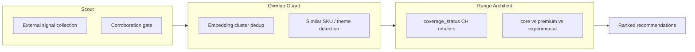

# Zenline Alignment — How Our Hackathon Build Maps to the Real Platform

**Purpose:** Align the hackathon demo with what Zenline actually sells, so the jury sees a **credible extension** of assortment intelligence — not a unrelated side project.

**References:**
- [What data does Zenline use?](https://www.tryzenline.ai/blog/what-data-does-zenline-use-for-assortment-decisions)
- [Fashion case study — demand signals & overlap](https://www.tryzenline.ai/blog/case-study-fashion-preventing-season-end-markdowns-through-pre-season-assortment-overlap-detection)

---

## What Zenline Does (context)

Zenline is an **AI assortment intelligence platform** for retail:

- Category-agnostic (beauty, electronics, outdoor, etc.)
- Combines **retailer internal data** (sales, margin, PIM, inventory, ERP/POS) with **external signals** (competitor assortment, pricing, reviews, search, social, marketplaces)
- Supports pricing optimization, launches, assortment audits, category management
- Built for messy data — similarity models, LLMs, image recognition when structure is missing
- Clients include MediaMarkt, dm, Delivery Hero; pricing per category optimized

**Our hackathon scope:** We demo the **external signal + decision layer** for a Swiss outdoor retailer. We do **not** have their POS/ERP — and we say that clearly.

---

## Our Product Name for the Demo

### **Zenline Scout — Outdoor Early Signal Module**

One-line pitch:

> **Scout spots emerging outdoor opportunities from external demand and competitor signals before sales data confirms them — then recommends what a Swiss retailer should test, add, or monitor.**

This maps directly to Mary's **Scout** concept:

| Scout (Zenline concept) | Our implementation |
|---|---|
| Problem: category teams see demand too late | Collect search velocity + marketplace + competitor signals early |
| User: buyers, category managers | Swiss outdoor buying team (Transa-style scenario) |
| ROI: better hit rate, fewer missed opps | Ranked opportunities with confidence + CH transferability |
| Output: act before competitors | `recommended_action`: test-buy, pilot bay, supplier contact, monitor |

---

## Three Modules → Three Demo Tabs

Map Mary's three ideas to what we build:

| Module | Solves | Our feature | Demo moment |
|---|---|---|---|
| **Scout** | Demand seen too late | Tavily + pytrends + CH competitor scan | "Gravel shoes rising in US search; CH shoe bay unclear" |
| **Overlap Guard** | Too many similar SKUs | Embedding clusters merge duplicate narratives | "Don't buy 5 PFAS-free shells that cannibalize each other — pick a lane" |
| **Range Architect** | Signals → right mix | `coverage_status` + transferability + action type | "Core: PFAS-free filter; Experimental: And Wander test order" |

**Streamlit tab mapping (recommended):**
1. **Scout** — Ranked emerging opportunities  
2. **Evidence** — Signal trail (Zenline-style external data transparency)  
3. **Overlap Guard** — Cluster view: merged signals, overlap warnings  
4. **Range Architect** — Actions tagged: `core` / `premium` / `experimental` / `monitor`

---

## External Signals — Zenline Method vs Our Hackathon

Zenline measures external demand through four buckets. Here's what we use today:

### a) Search interest & trends ✅ PRIMARY

| Zenline method | Our source | Swiss focus |
|---|---|---|
| Google Trends-style volume | **pytrends** `geo='CH'` | German keywords: `PFAS frei`, `gravel laufschuhe` |
| Search velocity | Week-over-week delta from trends cache | Rising in US, flat in CH = early transfer |
| Rate of change | MoM interest comparison | Document in `notes` field |

`signal_type=search`

---

### b) Online marketplace & e-commerce ✅ PRIMARY

| Zenline method | Our source | Swiss focus |
|---|---|---|
| Product search / listing presence | **Tavily** + `site:transa.ch` etc. | CHF prices, SKU counts |
| Sales velocity / stockouts | Not fully available hackathon-day | Note as limitation; use review/rank proxies if found |
| Review volume trends | Optional Tavily pull | If time: Amazon.de / Galaxus reviews |
| Competitor assortment | Transa, Ochsner, Decathlon, Globetrotter | `coverage_status` field |

`signal_type=marketplace`, `competitor`

---

### c) Social & trend signals ⚠️ SECONDARY (if time)

| Zenline method | Our source | Notes |
|---|---|---|
| Hashtag / mention spikes | Tavily news/social search | Weak alone — must pass corroboration gate |
| Rising topics | Publication + trade press URLs | OIA, Outside, Endurance Sportswire |

`signal_type=social`, `web`

---

### d) Retailer behavioral data ❌ OUT OF SCOPE (acknowledge gap)

| Zenline method | Hackathon | What we say to jury |
|---|---|---|
| Site search on retailer.com | Not available | "Scout plugs into Zenline's existing POS/site-search layer in production" |
| Store locator searches | Not available | Same |
| CRM / campaign data | Not available | Same |

**Honest line:** *"Today we demo Scout on external signals only. In production, Zenline merges this with sales, margin, and inventory — exactly as described in their data blog."*

---

## Internal Data Zenline Uses (we simulate the gap)

From [Zenline's data blog](https://www.tryzenline.ai/blog/what-data-does-zenline-use-for-assortment-decisions):

| Internal source | Hackathon substitute |
|---|---|
| Sales / margin | Not available — use `coverage_status` + competitor price bands |
| PIM / master data | Our `SignalRow` schema = normalized external layer |
| Inventory | Stockout hints from competitor pages if visible |
| ERP / Snowflake | N/A — mention as integration point in architecture |

---

## How Zenline Combines Signals (mirror in scoring)

Zenline asks:
- Which SKUs have **growing demand** → add or keep  
- Which are **declining** → delist or discount  
- Which have **untapped demand** → launch in new regions  

Our outdoor equivalents:

| Zenline question | Our recommendation |
|---|---|
| Growing external demand + low CH coverage | **Test-buy / pilot bay** (Scout + Range Architect) |
| Growing demand + already crowded CH assortment | **Merchandising / differentiation** not new SKU (Overlap Guard) |
| Weak or single-source signal | **Monitor / research** (confidence gate = Zenline human review) |
| Strong global + strong CH regulatory fit | **Core range** candidate (PFAS-free) |

---

## Risks Zenline Names — How We Address Them

| Zenline risk | Our response |
|---|---|
| Noisy external trend signals | Corroboration gate: 2+ URLs, 2+ source types |
| Incomplete competitor mapping | Explicit `coverage_status` + manual CH retailer checks |
| Messy / missing structure | Pydantic schema + LLM extraction with URL-only evidence |
| Low recommendation quality early | Confidence labels + "monitor" default; human-review framing |
| Fragmented data formats | Normalized `signals.csv` / `recommendations.json` contract |

---

## Switzerland Story (why outdoor + CH fits Zenline)

- Zenline sells to **DACH category teams** — Swiss outdoor is a concrete DACH scenario  
- [swisspo survey](https://swisspo.ch/de/erfolgreicher-winter-und-chancen-im-sommer-sportartikel-branche-beweist-stabilitaet-und-anpassungsfaehigkeit/): hiking + running shoes = Swiss retailer focus this summer  
- [Transa PFAS FAQ](https://www.transa.ch/de/blog/nachhaltigkeit/pfas-faq/): real CH retailer already thinking assortment + regulation  
- Category-agnostic proof: change `scenario.yaml` from outdoor → running → camping  

---

## Presentation Stack (Mary's note)

| Tool | Use |
|---|---|
| **ElevenLabs** | Generate voiceover for 60–90s demo video from [`business-storytelling.md`](business-storytelling.md) script |
| **Streamlit dashboard** | Live Scout + Range Architect demo |
| **SUBMISSION.md** | Architecture showing plug-in to Zenline internal data layer |

---

## Jury Soundbites (use these)

**Opening:**
> "Category teams see demand too late. Scout is Zenline's early-warning layer — external signals before POS confirms them."

**Middle:**
> "We don't just list trends. Overlap Guard clusters similar signals so buyers don't cannibalize their own assortment. Range Architect turns what's left into core, premium, or experimental actions for Switzerland."

**Close:**
> "This is category-agnostic, evidence-gated, and designed to plug into Zenline's existing sales and margin data — exactly how the platform works for MediaMarkt and dm today."

---

## SUBMISSION.md — Architecture paragraph (draft)

> We built **Zenline Scout** for outdoor retail: an external signal module that collects search trends, competitor assortment, and publication evidence; deduplicates overlapping themes (Overlap Guard); and outputs ranked assortment actions with Swiss transferability scores (Range Architect). The hackathon demo runs on public data only. In production, this module merges with Zenline's internal POS, margin, and PIM feeds to recommend add/keep/drop/reprice decisions — consistent with Zenline's assortment intelligence platform.
